# Site-to-Site VPN with Palo Alto Firewalls (Multi-Zone Segmentation)
 
## Overview
Designed and implemented a secure site-to-site VPN connecting a headquarters site and a branch site over a simulated internet link, using Palo Alto firewalls, VLSM subnetting, and zone-based security policy enforcement. The goal was to let branch staff securely reach headquarters resources while keeping guest traffic isolated at both sites.

**Lab environment:** Palo Alto firewalls (2), routers (2), Windows client VMs (4), server VM (1) — built and tested in a virtualized topology.

## Topology
 
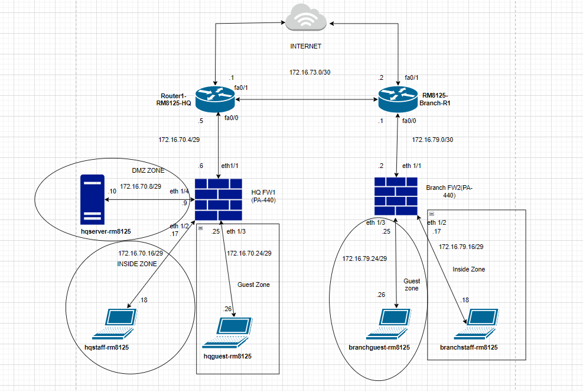

## Network Design
 
Base address space: `172.16.70.0/24`, `172.16.73.0/24`, `172.16.79.0/24`
 
Subnetted using VLSM to fit four functional zones:
 
| Site | Zone | Subnet |
|---|---|---|
| Internet link | Router-to-Router | 172.16.73.0/29 |
| Headquarters | Inside (staff) | 172.16.70.16/29 |
| Headquarters | Guest | 172.16.70.24/29 |
| Headquarters | DMZ (server) | 172.16.70.8/29 |
| Branch | Inside (staff) | 172.16.79.16/29 |
| Branch | Guest | 172.16.79.24/29 |
 
Four zones per firewall: **Internet, Inside, DMZ, Guest.**

## What Was Built
 
- **Interface & zone configuration** on both firewalls, with a dedicated virtual router per site to handle internal routing.
  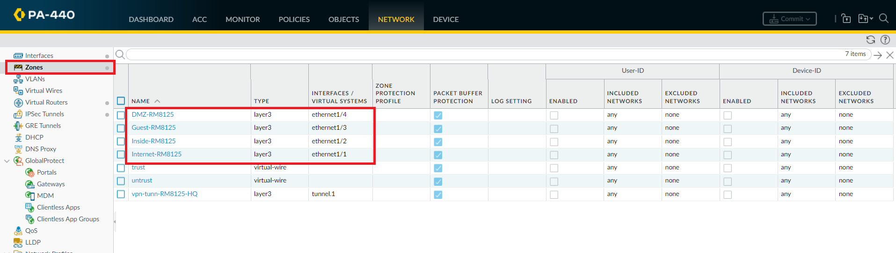
- **NAT policies** at each site translating internal (Inside/Guest/DMZ) traffic to the internet-facing interface, so private addressing stays hidden from the public side.

- **NAT policies** at each site translating internal (Inside/Guest/DMZ) traffic to the internet-facing interface, so private addressing stays hidden from the public side.
  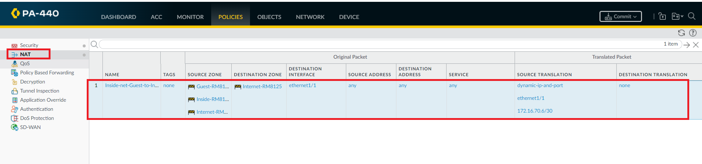
  
- **IPSec site-to-site tunnel** between the two firewalls:
  - Tunnel interfaces and a dedicated VPN zone/virtual router at each site
  - IKE Crypto Profile (Phase 1) and IPSec Crypto Profile (Phase 2)
  - IKE Gateway configuration and tunnel monitoring
  - Verified tunnel establishment (Phase 1 → Phase 2 → tunnel up) at both ends
    
  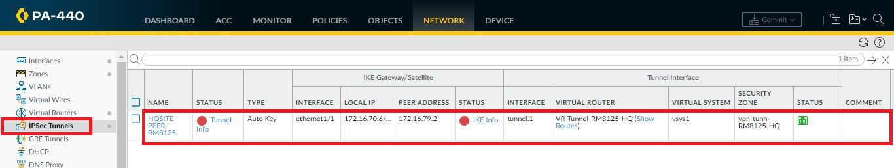
  
  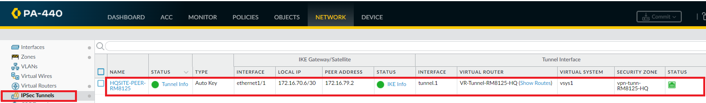
  
  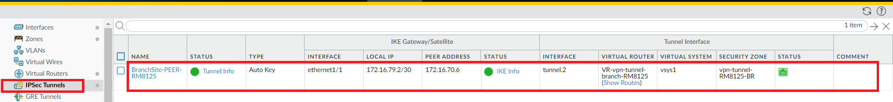
  
- **Zone-based security policies** enforcing least-privilege access across the tunnel:
  - Inside → Internet (staff get general internet access)
  - VPN → DMZ (cross-site access to the server is only allowed *through the encrypted tunnel*)
  - Guest → Internet only (no access to DMZ or Inside zones)
  - Inside → DMZ (local staff can reach the local server without transiting the VPN)
    
  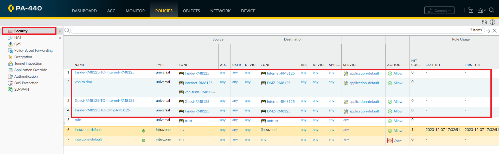
  
*(All of the above was mirrored on the branch-side firewall with its own zones, NAT policy, and tunnel configuration — see the Validation section below for cross-site proof both sides work together.)*

## Validation
 
Rather than just configuring and assuming it worked, each policy was tested with live ping traffic from the client VMs. Every claim below is backed by an actual test:
 
**Headquarters staff (Inside) → reach headquarters DMZ server: allowed**
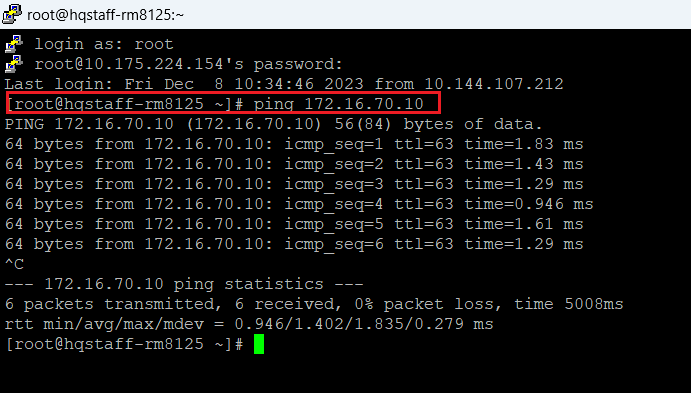
 
**Headquarters staff (Inside) → reach internet: allowed**
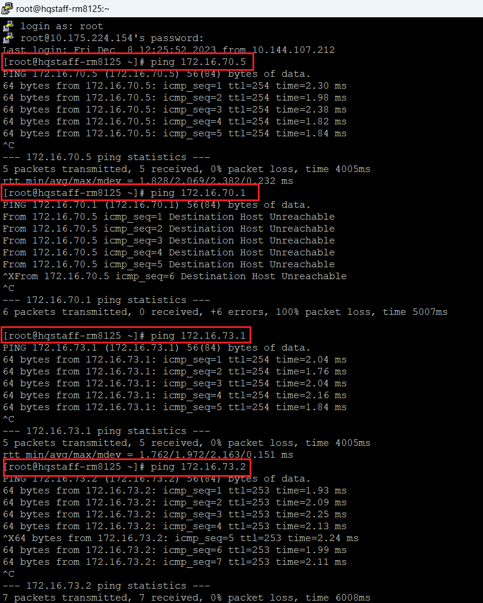
 
**Headquarters guest → reach internet only, blocked from DMZ/Inside: confirmed**
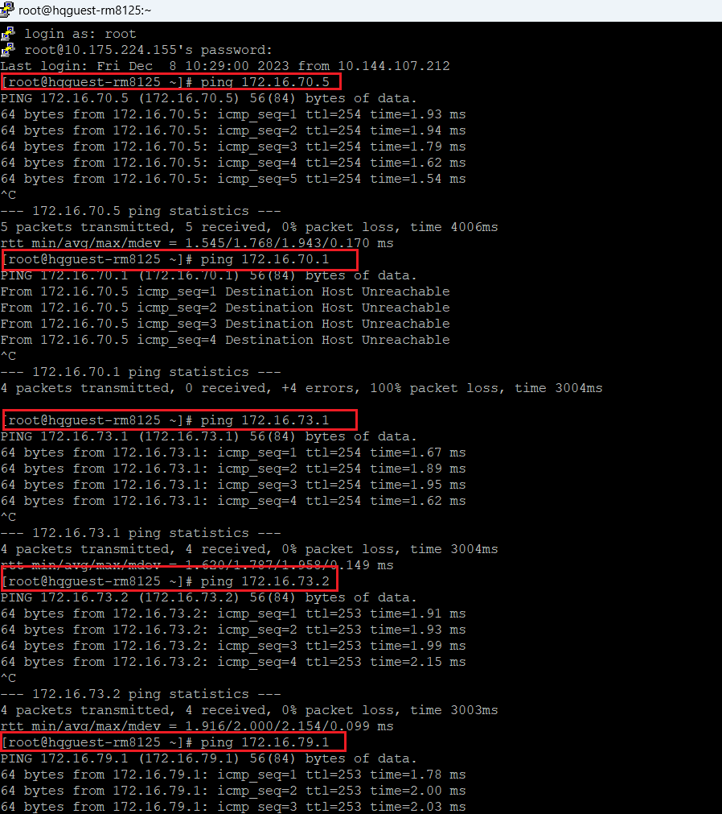
 
**Branch staff (Inside) → reach headquarters DMZ server over the VPN tunnel: allowed**
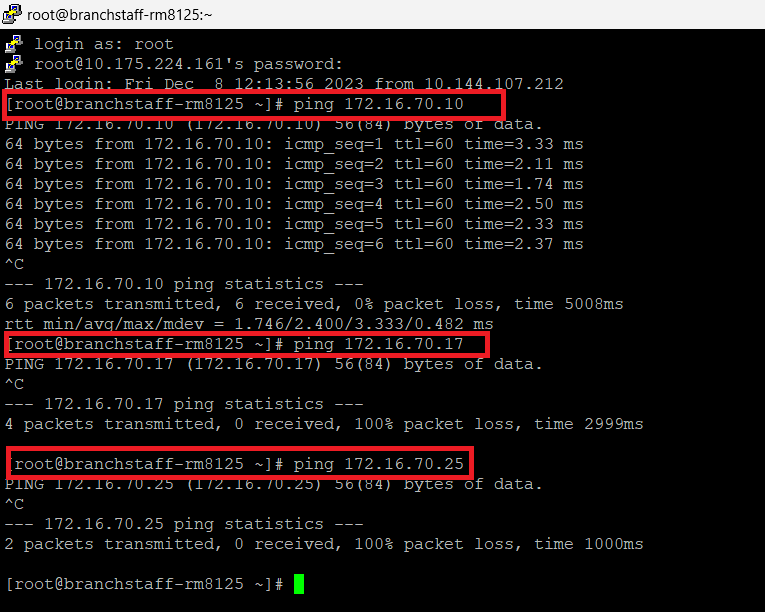
 
**Branch staff → reach headquarters Guest/Inside zones directly: blocked, as intended**
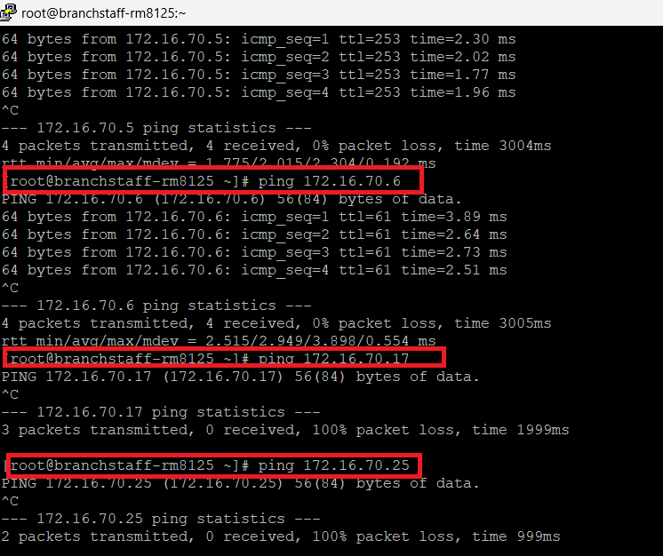
 
**Branch guest → internet only: confirmed**
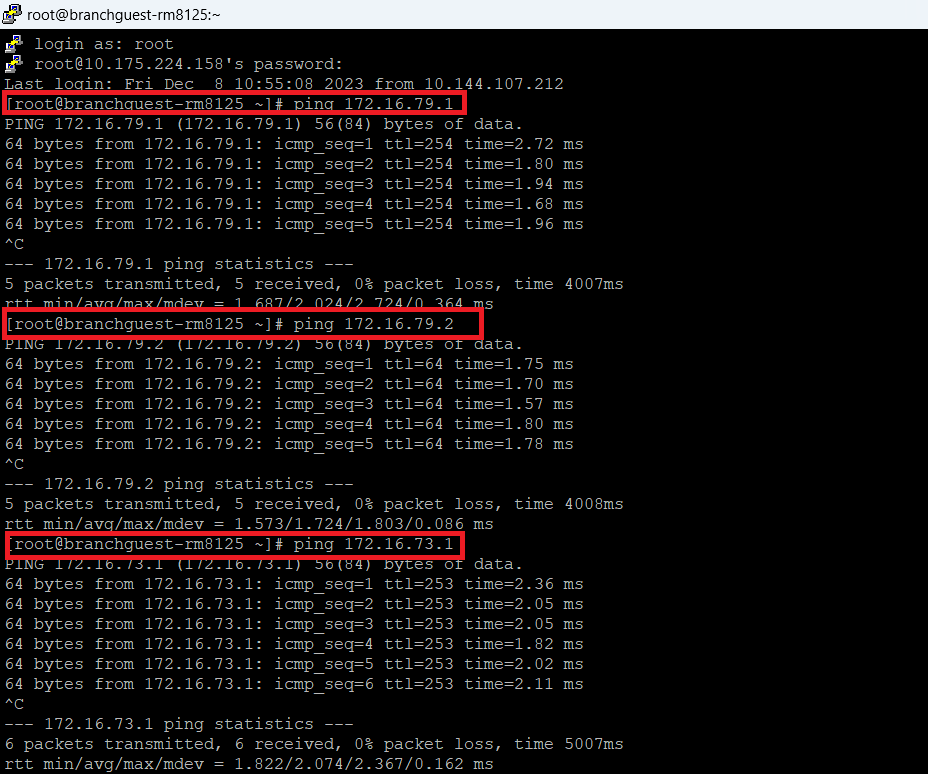
 
This confirmed the tunnel wasn't just "up" — the security policy was actually shaping traffic the way the design called for.

## Key Takeaways
 
- Practiced subnetting a single address block into functionally isolated zones using VLSM, rather than treating each zone as a flat, oversized network.
- Learned the practical difference between IKE Phase 1 (authentication/key exchange) and Phase 2 (IPSec SA/tunnel data path) when troubleshooting a tunnel that won't come up.
- Reinforced that a working tunnel is not the same as a secure design — zone-based policy is what actually enforces the segmentation requirements.
- If extending this project: add logging/alerting on the security policies (e.g., forwarding to a SIEM) to turn this from a working network into something a SOC could actually monitor.
